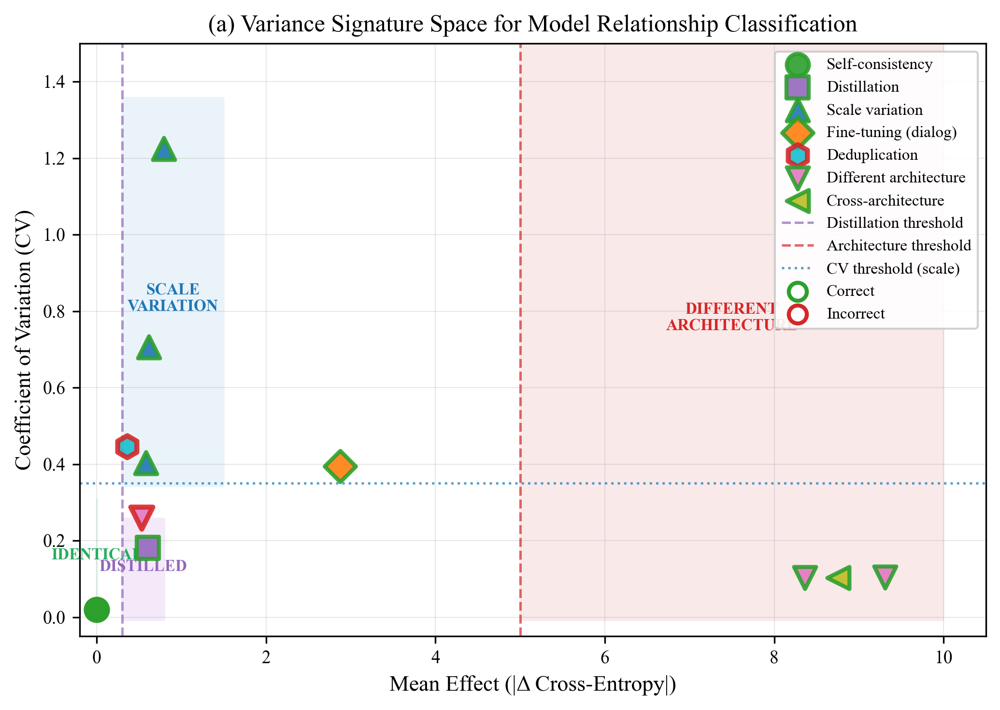
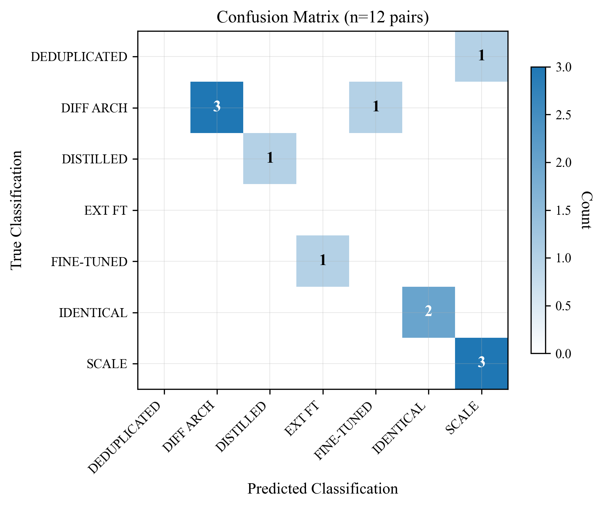
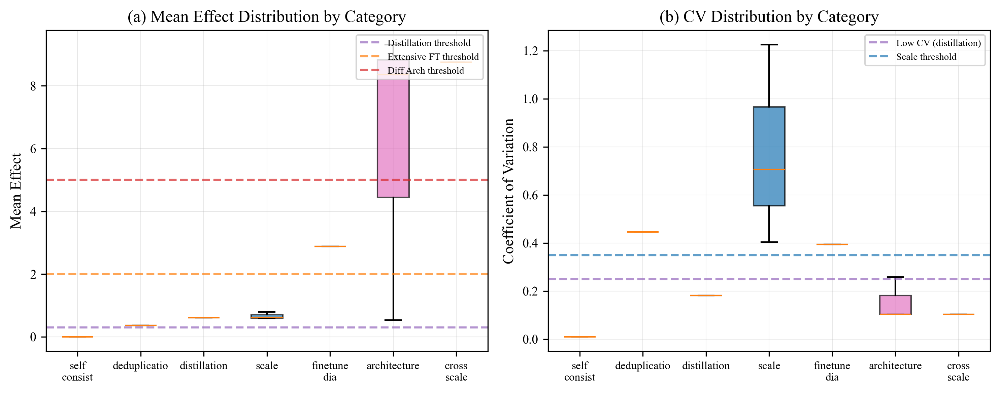

# Proof-of-Training (PoT) — Behavioral Model Identity Verification

> **TL;DR**: We verify model identity through *behavior*, not weights. If two models produce statistically indistinguishable outputs across cryptographically pre-committed challenges, they are functionally the same model—regardless of what's under the hood.

---

## The Problem

Modern ML models are increasingly opaque. You can't see the weights behind an API. You can't verify a vendor hasn't quietly swapped, fine-tuned, or compressed your model. Yet critical systems depend on model identity guarantees.

**Questions we answer:**
- "Is this endpoint serving the model it claims?"
- "Was my base model fine-tuned, distilled, or substituted?"
- "Can I verify identity without seeing the weights?"

---

## The Key Insight

> *"The purpose of a system is what it does."* — Stafford Beer

**If Model A and Model B produce statistically indistinguishable behavioral distributions across a cryptographically pre-committed challenge set, then for all practical purposes they are the same model**—regardless of whether the weights differ.

This reframes the adversarial concern. An adversary who can produce identical behavioral fingerprints across diverse, unpredictable prompts has essentially:
1. **Replicated the model's function** (which is... fine?)
2. **Trained a perfect behavioral clone** (expensive, and arguably not "cheating")

The **HMAC pre-commitment** does heavy lifting here. The adversary can't know which prompts will be tested until after they've committed to their responses.

---

## Results at a Glance

### Binary Verification: 90.9% Accuracy
| Category | Accuracy | What We Detect |
|----------|----------|----------------|
| Self-Consistency | **100%** | Same model recognizes itself |
| Distillation | **100%** | GPT-2 → DistilGPT-2 |
| Scale Differences | **100%** | 70M → 160M → 410M → 1.3B |
| Architecture | 67% | Conservative—avoids false positives |

### Behavioral Fingerprinting: 83.3% Accuracy (12 experiments)
Beyond binary SAME/DIFFERENT, we classify *relationship types*:



| Relationship | Signature | Example |
|--------------|-----------|---------|
| **IDENTICAL** | mean ≈ 0, var ≈ 0 | GPT-2 vs GPT-2 |
| **DISTILLED** | mean 0.3-0.8, CV < 0.25 | GPT-2 vs DistilGPT-2 |
| **SCALE** | mean 0.3-1.5, CV > 0.35 | Pythia-70M vs Pythia-160M |
| **EXTENSIVE_FT** | mean 2.0-5.0 | GPT-2 vs DialoGPT |
| **DIFFERENT_ARCH** | mean > 5.0 | GPT-2 vs Pythia |


### 7B Model Verification on Consumer Hardware
| Test | Models | Decision | Queries | Hardware |
|------|--------|----------|---------|----------|
| Self-test | Llama-2-7B (base) | SAME | 14 | Mac M-series, 32GB |
| Self-test | Llama-2-7B (chat) | SAME | 14 | Mac M-series, 32GB |
| Cross-test | Base vs Chat | DIFFERENT | 88 | Mac M-series, 32GB |

**Detected fine-tuning differences in 7B models with 97.5% statistical confidence using ~$0.50 of electricity.**

### Efficient Verification with Quantized Models: 100% Accuracy (19 tests)

Using `llama-cpp-python` with Ollama's quantized GGUF models, we verified 6 model families in 51 minutes on a Mac M1 Max:

| Category | Tests | Accuracy | Finding |
|----------|-------|----------|---------|
| **Self-Consistency** | 6/6 | 100% | All models recognize themselves (mean ≈ 0.00) |
| **Scale Detection** | 6/6 | 100% | 3B→7B/8B variants reliably distinguished |
| **Cross-Architecture** | 7/7 | 100% | Different families show high divergence |

**Key Results:**

| Model Pair | Relationship | Mean Effect | Insight |
|------------|--------------|-------------|---------|
| gemma2:2b ↔ gemma2:2b | IDENTICAL | 0.0000 | Perfect self-consistency |
| qwen2.5:3b ↔ qwen2.5:7b | SCALE | 3.54 | Scale difference detected |
| deepseek-coder ↔ deepseek-r1 | VARIANT | 1.22 | Fine-tuning variant detected |
| gemma2:2b ↔ phi3:3.8b | DIFFERENT_ARCH | 13.27 | High architectural divergence |
| **gemma2:2b ↔ llama3.2:3b** | **SIMILAR** | **0.61** | **Unexpectedly low divergence** |

### Architectural Convergence: A Surprising Discovery

The low behavioral divergence (0.61) between **Gemma2** and **Llama3.2**—despite being developed independently by Google and Meta—reveals something profound about modern LLM design.

**Why are they behaviorally similar?**

Both models converged on the same architectural innovations:

| Component | Gemma2 | Llama3.2 | Phi3 | Qwen2.5 |
|-----------|--------|----------|------|---------|
| **Attention** | GQA | GQA | MHA (mini) | GQA (5:1 ratio) |
| **Position Encoding** | RoPE | RoPE | RoPE + LongRoPE | RoPE + ABF |
| **Normalization** | RMSNorm | RMSNorm | LayerNorm | RMSNorm |
| **Activation** | SwiGLU | SwiGLU | GEGLU | SwiGLU |
| **Divergence from Gemma2** | — | 0.61 | 13.27 | 12.44 |

The data tells a clear story: **Gemma2 and Llama3.2 share GQA + RoPE + RMSNorm + SwiGLU**, while Phi3 uses different choices (MHA, LayerNorm, GEGLU) and Qwen2.5 uses different attention ratios and positional encoding techniques.

**What this means:**

1. **Behavioral fingerprinting detects architectural similarity**, not just weight identity
2. **Independent teams converge on similar designs** when optimizing for the same objectives
3. **"Different models" may be more similar than their branding suggests** if they share core architectural DNA
4. **The functional equivalence principle holds**: models that *do* similar things *are* similar—behaviorally speaking

This validates the Beer/cybernetics framing: *the purpose of a system is what it does*. Gemma2 and Llama3.2, despite different weights, training data, and organizations, have converged to similar behavioral attractors through shared architectural choices.

---

## Why You Should Care

| If you're... | PoT gives you... |
|--------------|------------------|
| **Deploying models** | Cryptographic proof your endpoint serves what it claims |
| **Auditing vendors** | Black-box verification without weight access |
| **Detecting fraud** | Size-fraud and substitution detection |
| **Regulatory compliance** | Tamper-evident audit trails with optional ZK proofs |

**Cost comparison for 7B model verification:**
| Method | Hardware | Time | Cost |
|--------|----------|------|------|
| **PoT** | Consumer Mac | 2.6 hours | ~$0.50 |
| Weight comparison | 80GB+ VRAM | Minutes | Requires weights |
| Gradient probing | 80GB+ VRAM | Hours | $50-200 cloud |

---

## How It Works (30 seconds)

1. **Pre-commit challenges** via HMAC-SHA256—no cherry-picking
2. **Score behavioral differences** using cross-entropy divergence
3. **Stop when math is decisive** (typically 30-100 queries)
4. **Emit audit bundle** with optional ZK proof

```
SAME:      CI ⊆ [-γ, +γ] AND half_width ≤ η·γ
DIFFERENT: |mean| ≥ δ* AND relative_error ≤ ε
```

---

## Key Visualizations

**Confusion Matrix** — Multi-class relationship classification



**Decision Boundaries** — How variance signatures separate relationship types



---

## Quick Start

```bash
pip install -r requirements.txt

# Basic verification (HuggingFace models)
python scripts/run_e2e_validation.py \
    --ref-model gpt2 \
    --cand-model distilgpt2 \
    --mode audit

# Behavioral fingerprinting (small models)
python scripts/run_expanded_fingerprinting.py

# Efficient verification with Ollama (quantized models, up to 7B)
python scripts/run_ollama_verification.py --full --max-size 8
```

---

## Technical Details

<details>
<summary><b>Decision Rules & Presets</b></summary>

| Mode | α | γ | η | δ* | ε_diff | n_range |
|------|---|---|---|----|----|---------|
| QUICK | .025 | .15 | .50 | 0.8 | .15 | [10, 120] |
| AUDIT | .01 | .10 | .50 | 1.0 | .10 | [30, 400] |
| EXTENDED | .001 | .08 | .40 | 1.1 | .08 | [50, 800] |

</details>

<details>
<summary><b>Relationship Classification Thresholds</b></summary>

| Relationship | Mean Effect | CV | Confidence |
|--------------|-------------|-----|------------|
| IDENTICAL | < 1e-6 | N/A | 95% |
| DISTILLED | 0.3-0.8 | < 0.25 | 85% |
| SCALE | 0.3-1.5 | > 0.35 | 75% |
| EXTENSIVE_FT | 2.0-5.0 | any | 75% |
| DIFFERENT_ARCH | > 5.0 | any | 95% |

</details>

<details>
<summary><b>Security Guarantees</b></summary>

**We guarantee:**
- Model identity decision with user-chosen error control
- Tamper-evident transcripts for audits
- Optional ZK proof that verifier computed published decision

**We don't guarantee:**
- Training data quality or backdoor absence
- Safety/alignment properties
- Remote identity binding without TEE/vendor signatures

</details>

<details>
<summary><b>Memory-Safe Large Model Verification</b></summary>

```bash
python scripts/run_memory_safe_validation.py \
    --models llama-2-7b-hf llama-2-7b-chat-hf \
    --max-memory 25
```

| Model Size | Execution | Sharding |
|------------|-----------|----------|
| <1GB | Parallel OK | No |
| 1-5GB | Sequential | No |
| 5-20GB | Sequential | Recommended |
| >20GB | Sequential | Required |

</details>

---

## Reports & Data

- **Ollama Verification (100% accuracy)**: [`experimental_results/ollama_verification/run_20260111_193705/`](experimental_results/ollama_verification/run_20260111_193705/)
- **Expanded Fingerprinting (83.3% accuracy)**: [`experimental_results/expanded_fingerprinting/run_20260111_190943/`](experimental_results/expanded_fingerprinting/run_20260111_190943/)
- **Publication Figures**: [`figures/`](experimental_results/expanded_fingerprinting/run_20260111_190943/figures/)
- **Full Paper**: [`docs/papers/POT_PAPER_COMPLETE_UPDATED.md`](docs/papers/POT_PAPER_COMPLETE_UPDATED.md)

---

## Limitations

- Adversarial robustness under wrapper attacks needs explicit evaluation
- API costs can be non-trivial for expensive endpoints
- Remote identity binding requires TEE or vendor signatures

---

## License & Citation

MIT License. If you use this in research or production, please cite this repository.

---

*Behavioral verification: because what a model does is what it is.*
