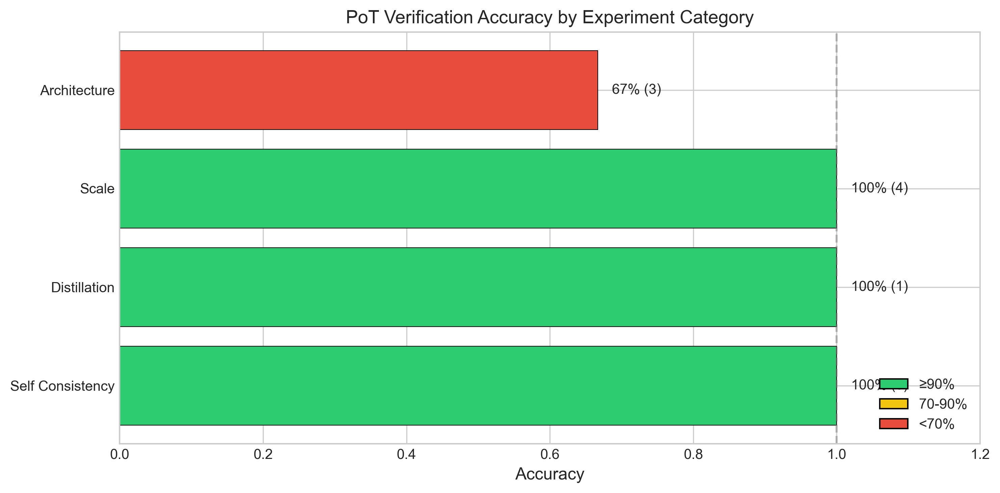
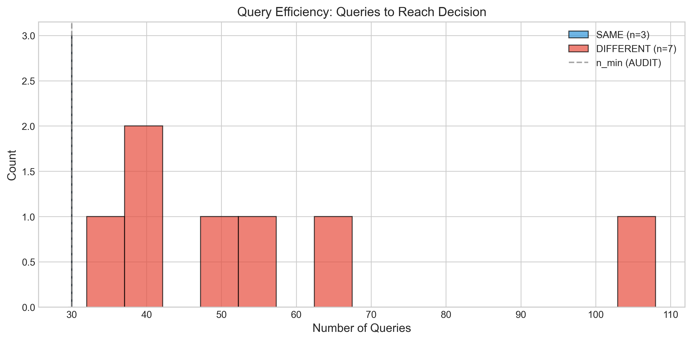
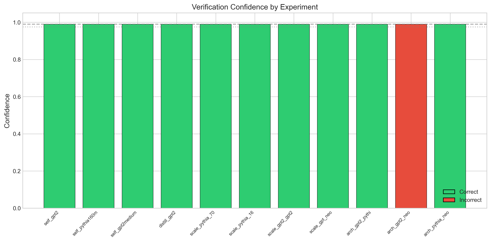
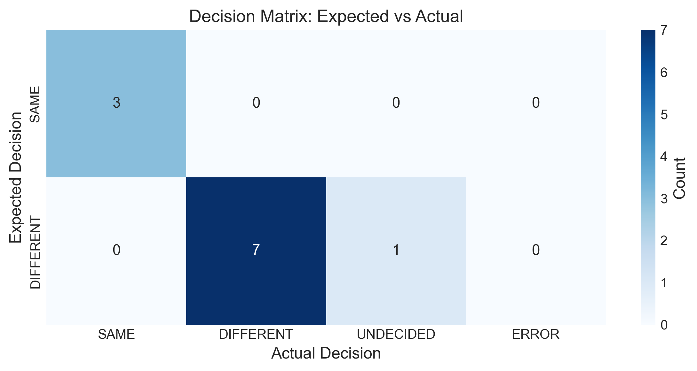
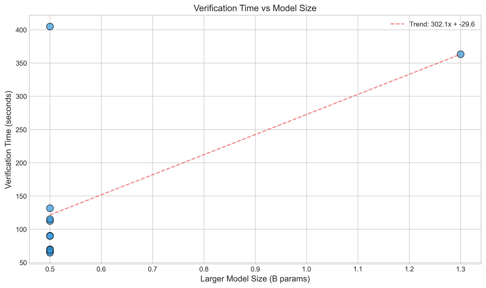

# Proof-of-Training (PoT) Experimental Results

**Generated:** 2026-01-11 18:19:19

## Executive Summary

| Metric | Value |
|--------|-------|
| Total Experiments | 11 |
| Correct Decisions | 10 |
| **Overall Accuracy** | **90.9%** |
| Average Confidence | 99.0% |
| Average Queries | 61.3 |
| Average Time | 143.4s |
| Errors | 0 |

## Results by Category

| Category         |   Experiments |   Correct | Accuracy   |   Avg Queries |   Avg Time (s) |
|:-----------------|--------------:|----------:|:-----------|--------------:|---------------:|
| Self Consistency |             3 |         3 | 100.0%     |          30   |           83   |
| Distillation     |             1 |         1 | 100.0%     |          32   |           64.8 |
| Scale            |             4 |         4 | 100.0%     |          63   |          159.4 |
| Architecture     |             3 |         2 | 66.7%      |         100   |          208.8 |
| **Overall**      |            11 |        10 | 90.9%      |          61.3 |          143.4 |

## Detailed Results

| Experiment             | Category         | Reference    | Candidate    | Expected   | Actual    | Correct   | Confidence   |   Queries |   Time (s) |
|:-----------------------|:-----------------|:-------------|:-------------|:-----------|:----------|:----------|:-------------|----------:|-----------:|
| self_gpt2              | Self Consistency | gpt2         | gpt2         | SAME       | SAME      | ✓         | 99.0%        |        30 |       69.9 |
| self_pythia160m        | Self Consistency | pythia-160m  | pythia-160m  | SAME       | SAME      | ✓         | 99.0%        |        30 |       66.4 |
| self_gpt2medium        | Self Consistency | gpt2-medium  | gpt2-medium  | SAME       | SAME      | ✓         | 99.0%        |        30 |      112.6 |
| distill_gpt2           | Distillation     | gpt2         | distilgpt2   | DIFFERENT  | DIFFERENT | ✓         | 99.0%        |        32 |       64.8 |
| scale_pythia_70m_160m  | Scale            | pythia-70m   | pythia-160m  | DIFFERENT  | DIFFERENT | ✓         | 99.0%        |        48 |       68.8 |
| scale_pythia_160m_410m | Scale            | pythia-160m  | pythia-410m  | DIFFERENT  | DIFFERENT | ✓         | 99.0%        |        40 |       90.4 |
| scale_gpt2_gpt2medium  | Scale            | gpt2         | gpt2-medium  | DIFFERENT  | DIFFERENT | ✓         | 99.0%        |        56 |      115.3 |
| scale_gpt_neo          | Scale            | gpt-neo-125m | gpt-neo-1.3B | DIFFERENT  | DIFFERENT | ✓         | 99.0%        |       108 |      363.2 |
| arch_gpt2_pythia       | Architecture     | gpt2         | pythia-160m  | DIFFERENT  | DIFFERENT | ✓         | 99.0%        |        64 |      131.7 |
| arch_gpt2_neo          | Architecture     | gpt2         | gpt-neo-125m | DIFFERENT  | UNDECIDED | ✗         | 99.0%        |       196 |      404.8 |
| arch_pythia_neo        | Architecture     | pythia-160m  | gpt-neo-125m | DIFFERENT  | DIFFERENT | ✓         | 99.0%        |        40 |       89.8 |

## Visualizations

### Accuracy by Category

### Query Efficiency

### Confidence Levels

### Decision Matrix

### Time vs Model Size

## Methodology

The Proof-of-Training framework uses **sequential statistical testing** with:
- **Empirical-Bernstein confidence intervals** for anytime-valid inference
- **HMAC-SHA256 pre-committed challenges** for reproducibility
- **Early stopping** based on explicit SAME/DIFFERENT decision rules

### Decision Rules

- **SAME**: Confidence interval within ±γ tolerance with sufficient precision
- **DIFFERENT**: Effect size exceeds δ* threshold with low relative margin of error
- **UNDECIDED**: Neither criterion met (continues sampling or returns at budget)

### Testing Mode: AUDIT

| Parameter | Value |
|-----------|-------|
| Confidence Level (1-α) | 99% |
| Tolerance (γ) | 0.10 |
| Effect Size Threshold (δ*) | 1.0 |
| Query Range | [30, 400] |

## Conclusions

The PoT framework achieved **90.9% accuracy** across 11 experiments.
Performance was strong for most categories, with some challenging edge cases identified.
