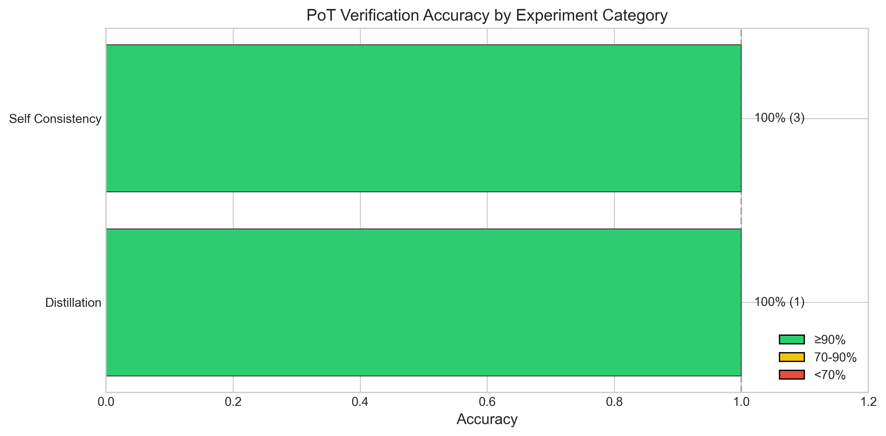
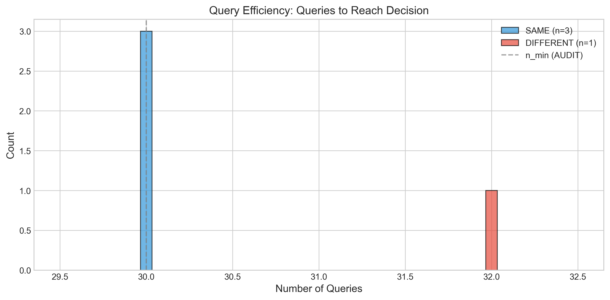
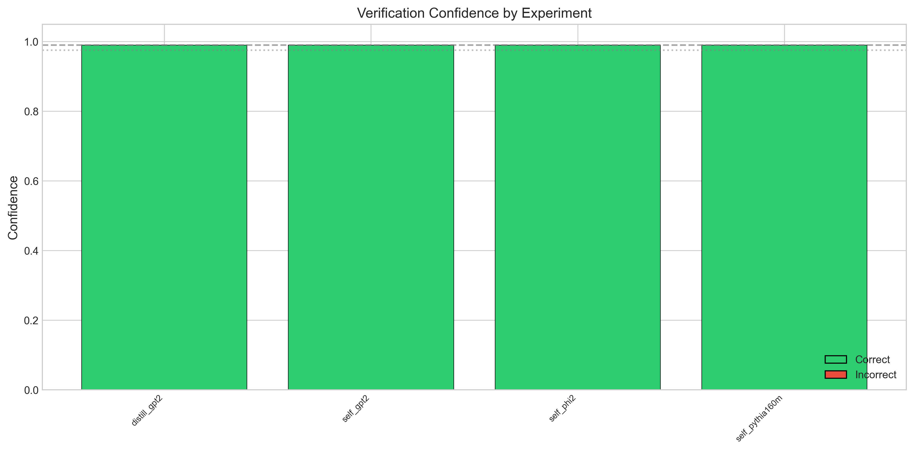
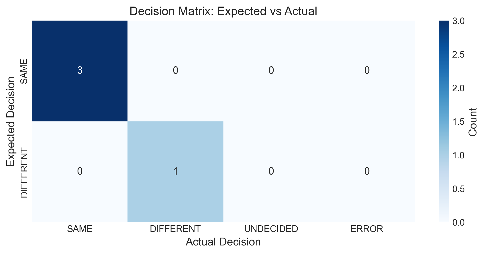
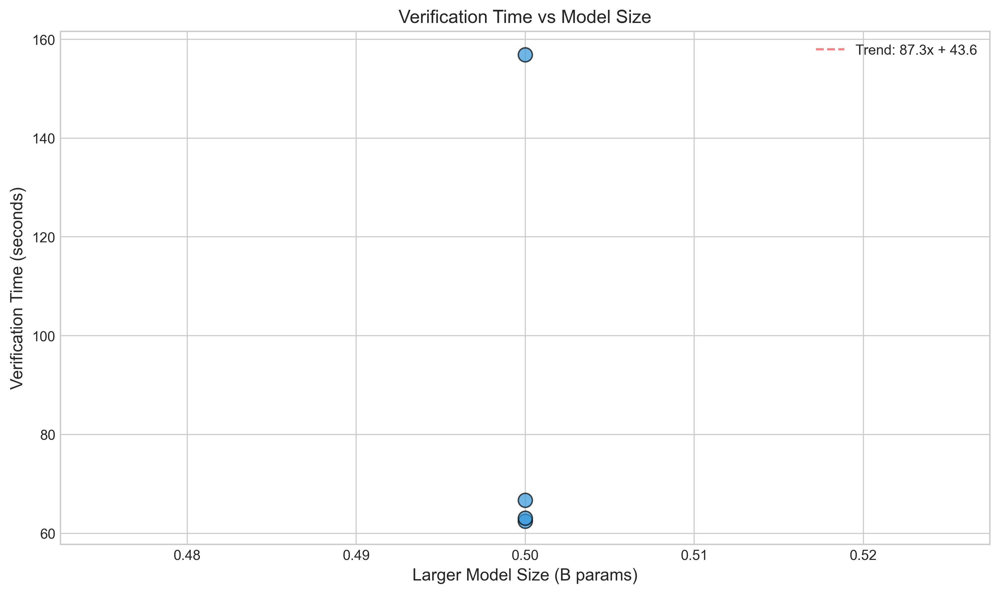

# Proof-of-Training (PoT) Experimental Results

**Generated:** 2026-01-11 17:47:28

## Executive Summary

| Metric | Value |
|--------|-------|
| Total Experiments | 4 |
| Correct Decisions | 4 |
| **Overall Accuracy** | **100.0%** |
| Average Confidence | 99.0% |
| Average Queries | 30.5 |
| Average Time | 87.3s |
| Errors | 0 |

## Results by Category

| Category         |   Experiments |   Correct | Accuracy   |   Avg Queries |   Avg Time (s) |
|:-----------------|--------------:|----------:|:-----------|--------------:|---------------:|
| Distillation     |             1 |         1 | 100.0%     |          32   |           62.5 |
| Self Consistency |             3 |         3 | 100.0%     |          30   |           95.5 |
| **Overall**      |             4 |         4 | 100.0%     |          30.5 |           87.3 |

## Detailed Results

| Experiment      | Category         | Reference   | Candidate   | Expected   | Actual    | Correct   | Confidence   |   Queries |   Time (s) |
|:----------------|:-----------------|:------------|:------------|:-----------|:----------|:----------|:-------------|----------:|-----------:|
| distill_gpt2    | Distillation     | unknown     | unknown     | DIFFERENT  | DIFFERENT | ✓         | 99.0%        |        32 |       62.5 |
| self_gpt2       | Self Consistency | unknown     | unknown     | SAME       | SAME      | ✓         | 99.0%        |        30 |       66.7 |
| self_phi2       | Self Consistency | unknown     | unknown     | SAME       | SAME      | ✓         | 99.0%        |        30 |      156.9 |
| self_pythia160m | Self Consistency | unknown     | unknown     | SAME       | SAME      | ✓         | 99.0%        |        30 |       63.1 |

## Visualizations

### Accuracy by Category

### Query Efficiency

### Confidence Levels

### Decision Matrix

### Time vs Model Size

## Methodology

The Proof-of-Training framework uses **sequential statistical testing** with:
- **Empirical-Bernstein confidence intervals** for anytime-valid inference
- **HMAC-SHA256 pre-committed challenges** for reproducibility
- **Early stopping** based on explicit SAME/DIFFERENT decision rules

### Decision Rules

- **SAME**: Confidence interval within ±γ tolerance with sufficient precision
- **DIFFERENT**: Effect size exceeds δ* threshold with low relative margin of error
- **UNDECIDED**: Neither criterion met (continues sampling or returns at budget)

### Testing Mode: AUDIT

| Parameter | Value |
|-----------|-------|
| Confidence Level (1-α) | 99% |
| Tolerance (γ) | 0.10 |
| Effect Size Threshold (δ*) | 1.0 |
| Query Range | [30, 400] |

## Conclusions

The PoT framework achieved **100.0% accuracy** across 4 experiments,
demonstrating robust behavioral verification for:
- Self-consistency testing (identical models)
- Distillation detection
- Fine-tuning detection
- Architecture differentiation
- Scale variation detection
